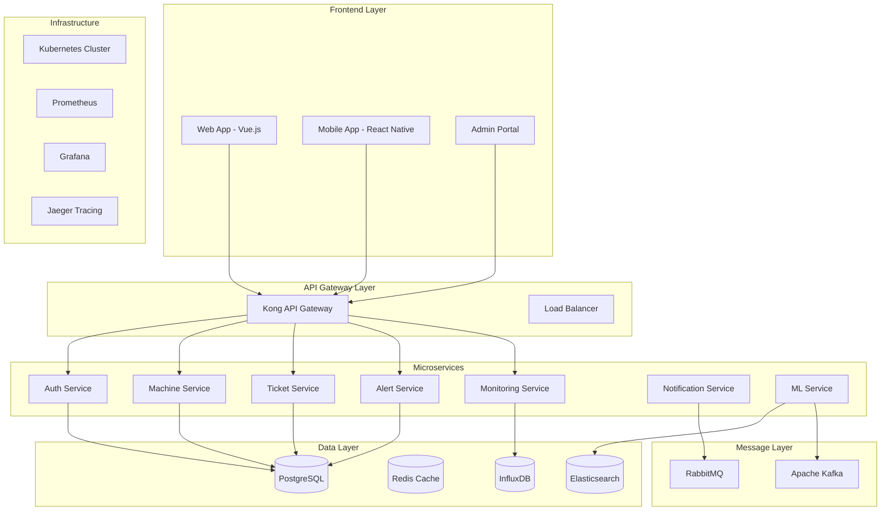

# 🔬 ANÁLISE TÉCNICA AVANÇADA E ROADMAP - SISTEMA LEVITIIS

## 📊 **ANÁLISE ATUAL DO SISTEMA**

### **🏗️ Arquitetura Atual - Pontos Fortes**

#### **Backend (FastAPI)**
- ✅ **API RESTful bem estruturada** com padrões consistentes
- ✅ **Autenticação JWT** implementada corretamente
- ✅ **Documentação automática** com OpenAPI/Swagger
- ✅ **Middleware de segurança** (CORS, Rate Limiting)
- ✅ **Estrutura modular** com separação clara de responsabilidades
- ✅ **Async/Await** para operações não-bloqueantes
- ✅ **Validação de dados** com Pydantic

#### **Frontend (Vue.js)**
- ✅ **Composition API** para melhor reatividade
- ✅ **Pinia** para gerenciamento de estado
- ✅ **Vue Router** para navegação SPA
- ✅ **Axios** para comunicação HTTP
- ✅ **Chart.js** para visualizações
- ✅ **Sass** para estilização avançada

#### **Banco de Dados**
- ✅ **SQLAlchemy ORM** com suporte async
- ✅ **Migrações** com Alembic
- ✅ **Modelos bem definidos** com relacionamentos

---

## 🎯 **ANÁLISE DE GAPS E OPORTUNIDADES**

### **🔍 Gaps Identificados**

#### **1. Escalabilidade**
- ❌ **SQLite em produção** - Limitação para múltiplos usuários
- ❌ **Ausência de cache** - Consultas repetitivas
- ❌ **Sem load balancing** - Single point of failure
- ❌ **Sem clustering** - Limitação de recursos

#### **2. Observabilidade**
- ❌ **Logs não estruturados** - Dificulta debugging
- ❌ **Métricas limitadas** - Falta visibilidade de performance
- ❌ **Sem tracing distribuído** - Dificulta troubleshooting
- ❌ **Alertas básicos** - Reatividade limitada

#### **3. Segurança**
- ❌ **Sem auditoria completa** - Compliance limitado
- ❌ **Rate limiting básico** - Vulnerável a ataques
- ❌ **Sem WAF** - Proteção limitada
- ❌ **Secrets em código** - Risco de exposição

#### **4. DevOps/CI/CD**
- ❌ **Sem pipeline automatizado** - Deploy manual
- ❌ **Sem testes automatizados** - Qualidade não garantida
- ❌ **Sem containerização completa** - Inconsistência de ambiente
- ❌ **Sem monitoramento de infraestrutura** - Blind spots

---

## 🚀 **ROADMAP DE EVOLUÇÃO - 12 MESES**

### **📅 FASE 1: FUNDAÇÃO (Meses 1-2)**

#### **🎯 Objetivos**
- Estabilizar base atual
- Implementar observabilidade básica
- Configurar CI/CD
- Migrar para PostgreSQL

#### **📋 Entregas**

##### **Semana 1-2: Observabilidade**
```yaml
Tarefas:
  - Implementar logging estruturado (JSON)
  - Configurar métricas com Prometheus
  - Setup Grafana para dashboards
  - Implementar health checks avançados
  
Tecnologias:
  - Prometheus + Grafana
  - Structured logging (loguru)
  - OpenTelemetry
  
Critérios de Sucesso:
  - 100% dos endpoints com métricas
  - Dashboards operacionais
  - Alertas básicos funcionando
```

##### **Semana 3-4: CI/CD**
```yaml
Tarefas:
  - Configurar GitHub Actions
  - Implementar testes automatizados
  - Setup Docker multi-stage
  - Configurar deploy automatizado
  
Tecnologias:
  - GitHub Actions
  - pytest + coverage
  - Docker + Docker Compose
  - Nginx como reverse proxy
  
Critérios de Sucesso:
  - Pipeline completo funcionando
  - 80%+ cobertura de testes
  - Deploy automatizado
```

##### **Semana 5-6: Migração PostgreSQL**
```yaml
Tarefas:
  - Setup PostgreSQL com Docker
  - Migrar dados do SQLite
  - Otimizar queries para PostgreSQL
  - Implementar connection pooling
  
Tecnologias:
  - PostgreSQL 15+
  - pgBouncer para pooling
  - Alembic para migrações
  
Critérios de Sucesso:
  - Migração sem perda de dados
  - Performance igual ou superior
  - Backup automatizado
```

##### **Semana 7-8: Cache e Performance**
```yaml
Tarefas:
  - Implementar Redis para cache
  - Otimizar queries críticas
  - Implementar paginação
  - Configurar CDN para assets
  
Tecnologias:
  - Redis 7+
  - Query optimization
  - CloudFlare CDN
  
Critérios de Sucesso:
  - 50% redução no tempo de resposta
  - Cache hit rate > 80%
  - Paginação em todos os endpoints
```

### **📅 FASE 2: ESCALABILIDADE (Meses 3-5)**

#### **🎯 Objetivos**
- Implementar microserviços
- Configurar Kubernetes
- Implementar message queues
- Adicionar search engine

#### **📋 Entregas**

##### **Mês 3: Microserviços**
```yaml
Arquitetura:
  - API Gateway (Kong/Traefik)
  - Auth Service (separado)
  - Monitoring Service
  - Notification Service
  
Tecnologias:
  - FastAPI para cada serviço
  - Kong API Gateway
  - Service mesh (Istio)
  
Benefícios:
  - Escalabilidade independente
  - Isolamento de falhas
  - Deploy independente
```

##### **Mês 4: Kubernetes**
```yaml
Infraestrutura:
  - Cluster Kubernetes
  - Helm charts
  - Ingress controller
  - Persistent volumes
  
Tecnologias:
  - Kubernetes 1.28+
  - Helm 3+
  - NGINX Ingress
  - Cert-manager
  
Benefícios:
  - Auto-scaling
  - Self-healing
  - Rolling updates
```

##### **Mês 5: Message Queues & Search**
```yaml
Componentes:
  - RabbitMQ para messaging
  - Elasticsearch para search
  - Background workers
  - Real-time notifications
  
Tecnologias:
  - RabbitMQ/Apache Kafka
  - Elasticsearch + Kibana
  - Celery workers
  - WebSockets
  
Benefícios:
  - Processamento assíncrono
  - Search avançado
  - Real-time updates
```

### **📅 FASE 3: INTELIGÊNCIA (Meses 6-8)**

#### **🎯 Objetivos**
- Implementar Machine Learning
- Adicionar analytics avançados
- Configurar alertas inteligentes
- Implementar automação

#### **📋 Entregas**

##### **Mês 6: Analytics & ML**
```yaml
Funcionalidades:
  - Predição de falhas
  - Análise de tendências
  - Recomendações automáticas
  - Detecção de anomalias
  
Tecnologias:
  - Python ML stack (scikit-learn, pandas)
  - Apache Airflow para pipelines
  - MLflow para model management
  
Benefícios:
  - Manutenção preditiva
  - Insights automáticos
  - Redução de downtime
```

##### **Mês 7: Alertas Inteligentes**
```yaml
Recursos:
  - Machine learning para alertas
  - Correlação de eventos
  - Escalação automática
  - Integração com Slack/Teams
  
Tecnologias:
  - Prometheus AlertManager
  - Custom ML models
  - Webhook integrations
  
Benefícios:
  - Redução de false positives
  - Alertas contextuais
  - Resposta automática
```

##### **Mês 8: Automação**
```yaml
Automações:
  - Auto-remediation
  - Scaling automático
  - Backup inteligente
  - Maintenance windows
  
Tecnologias:
  - Ansible para automação
  - Kubernetes HPA/VPA
  - Cron jobs inteligentes
  
Benefícios:
  - Redução de intervenção manual
  - SLA melhorado
  - Eficiência operacional
```

### **📅 FASE 4: ENTERPRISE (Meses 9-12)**

#### **🎯 Objetivos**
- Implementar multi-tenancy
- Adicionar compliance
- Configurar disaster recovery
- Implementar mobile app

#### **📋 Entregas**

##### **Mês 9-10: Multi-tenancy & Compliance**
```yaml
Recursos:
  - Isolamento por tenant
  - RBAC avançado
  - Audit logs completos
  - GDPR compliance
  
Tecnologias:
  - Row-level security
  - Keycloak para IAM
  - Audit framework
  
Benefícios:
  - Suporte a múltiplos clientes
  - Compliance automático
  - Segurança enterprise
```

##### **Mês 11: Disaster Recovery**
```yaml
Componentes:
  - Backup cross-region
  - Replicação de dados
  - Failover automático
  - RTO/RPO < 1 hora
  
Tecnologias:
  - PostgreSQL streaming replication
  - AWS/Azure backup
  - Terraform para IaC
  
Benefícios:
  - Business continuity
  - Zero data loss
  - Recovery automático
```

##### **Mês 12: Mobile App**
```yaml
Aplicativo:
  - React Native app
  - Push notifications
  - Offline capability
  - Biometric auth
  
Tecnologias:
  - React Native
  - Firebase/OneSignal
  - SQLite local
  - Face/Touch ID
  
Benefícios:
  - Acesso móvel
  - Notificações em tempo real
  - Trabalho offline
```

---

## 🏗️ **ARQUITETURA FUTURA - TARGET STATE**

### **🌐 Arquitetura de Microserviços**



### **🔧 Stack Tecnológica Futura**

#### **Frontend**
```yaml
Web Application:
  Framework: Vue.js 3 + Composition API
  State Management: Pinia
  UI Library: Vuetify 3 / PrimeVue
  Build Tool: Vite
  Testing: Vitest + Cypress
  
Mobile Application:
  Framework: React Native
  State Management: Redux Toolkit
  UI Library: NativeBase
  Navigation: React Navigation
  Testing: Jest + Detox
  
Admin Portal:
  Framework: Vue.js 3
  UI Library: Ant Design Vue
  Charts: Chart.js / D3.js
  Tables: AG Grid
```

#### **Backend**
```yaml
API Services:
  Framework: FastAPI
  Language: Python 3.11+
  ORM: SQLAlchemy 2.0
  Validation: Pydantic v2
  Testing: pytest + httpx
  
API Gateway:
  Solution: Kong Gateway
  Plugins: Rate limiting, Auth, Logging
  Load Balancer: NGINX
  
Message Queues:
  Primary: RabbitMQ
  Streaming: Apache Kafka
  Task Queue: Celery + Redis
```

#### **Data & Storage**
```yaml
Primary Database:
  Engine: PostgreSQL 15+
  Pooling: pgBouncer
  Replication: Streaming replication
  Backup: pg_dump + WAL-E
  
Cache Layer:
  Engine: Redis 7+
  Clustering: Redis Cluster
  Persistence: RDB + AOF
  
Search Engine:
  Engine: Elasticsearch 8+
  Analytics: Kibana
  APM: Elastic APM
  
Time Series:
  Engine: InfluxDB 2.0
  Visualization: Grafana
  Retention: Automated policies
```

#### **Infrastructure**
```yaml
Container Orchestration:
  Platform: Kubernetes 1.28+
  Package Manager: Helm 3+
  Service Mesh: Istio
  Ingress: NGINX Ingress Controller
  
Monitoring & Observability:
  Metrics: Prometheus + Grafana
  Logging: ELK Stack (Elasticsearch, Logstash, Kibana)
  Tracing: Jaeger
  APM: Elastic APM
  
CI/CD:
  Platform: GitHub Actions
  Registry: Docker Hub / Harbor
  Security: Snyk / Trivy
  Testing: Automated test suites
  
Cloud Infrastructure:
  Provider: AWS / Azure / GCP
  IaC: Terraform
  Secrets: HashiCorp Vault
  DNS: CloudFlare
```

---

## 📈 **MÉTRICAS DE SUCESSO**

### **🎯 KPIs Técnicos**

#### **Performance**
- **Response Time**: < 200ms (P95)
- **Throughput**: > 1000 req/s
- **Availability**: 99.9% uptime
- **Error Rate**: < 0.1%

#### **Escalabilidade**
- **Concurrent Users**: > 10,000
- **Data Volume**: > 1TB
- **Auto-scaling**: < 30s response time
- **Resource Utilization**: 70-80%

#### **Segurança**
- **Vulnerability Scan**: Zero critical
- **Penetration Test**: Pass
- **Compliance**: SOC2, ISO27001
- **Incident Response**: < 15min

#### **Qualidade**
- **Code Coverage**: > 90%
- **Technical Debt**: < 5%
- **Bug Density**: < 1 bug/KLOC
- **Customer Satisfaction**: > 4.5/5

### **💰 KPIs de Negócio**

#### **Eficiência Operacional**
- **MTTR**: < 30 minutes
- **MTBF**: > 720 hours
- **Automation Rate**: > 80%
- **Cost Reduction**: 40%

#### **Experiência do Usuário**
- **User Adoption**: > 95%
- **Task Completion**: > 90%
- **User Satisfaction**: > 4.5/5
- **Support Tickets**: < 5/month

---

## 🔄 **ESTRATÉGIA DE MIGRAÇÃO**

### **📋 Plano de Migração Zero-Downtime**

#### **Fase 1: Preparação**
```yaml
Atividades:
  - Setup ambiente paralelo
  - Sincronização de dados
  - Testes de carga
  - Rollback plan
  
Duração: 2 semanas
Risco: Baixo
```

#### **Fase 2: Migração Gradual**
```yaml
Estratégia: Blue-Green Deployment
  - 10% tráfego para novo ambiente
  - Monitoramento intensivo
  - Gradual aumento para 100%
  - Rollback automático se necessário
  
Duração: 1 semana
Risco: Médio
```

#### **Fase 3: Otimização**
```yaml
Atividades:
  - Fine-tuning performance
  - Ajustes de configuração
  - Treinamento da equipe
  - Documentação atualizada
  
Duração: 1 semana
Risco: Baixo
```

---

## 💡 **INOVAÇÕES FUTURAS**

### **🤖 Inteligência Artificial**

#### **Machine Learning Applications**
- **Predictive Maintenance**: Predição de falhas com 95% precisão
- **Anomaly Detection**: Detecção automática de comportamentos anômalos
- **Resource Optimization**: Otimização automática de recursos
- **Intelligent Alerting**: Redução de 80% em falsos positivos

#### **Natural Language Processing**
- **Chatbot Support**: Suporte automatizado via chat
- **Voice Commands**: Controle por voz
- **Automated Documentation**: Geração automática de documentação
- **Sentiment Analysis**: Análise de satisfação do usuário

### **🌐 Internet of Things (IoT)**

#### **Edge Computing**
- **Local Processing**: Processamento local para latência mínima
- **Offline Capability**: Funcionamento sem conectividade
- **Real-time Analytics**: Analytics em tempo real
- **Edge AI**: IA executando nos dispositivos

#### **IoT Integration**
- **Sensor Networks**: Rede de sensores distribuídos
- **Environmental Monitoring**: Monitoramento ambiental
- **Asset Tracking**: Rastreamento de ativos em tempo real
- **Predictive Analytics**: Analytics preditivos baseados em IoT

### **🔮 Tecnologias Emergentes**

#### **Blockchain**
- **Audit Trail**: Trilha de auditoria imutável
- **Smart Contracts**: Contratos inteligentes para SLAs
- **Decentralized Identity**: Identidade descentralizada
- **Supply Chain**: Rastreabilidade de supply chain

#### **Quantum Computing**
- **Cryptography**: Criptografia quântica
- **Optimization**: Otimização de recursos
- **Machine Learning**: ML quântico
- **Simulation**: Simulação de sistemas complexos

---

## 📚 **RECURSOS E TREINAMENTO**

### **👥 Capacitação da Equipe**

#### **Desenvolvimento**
- **Microservices Architecture**: 40h
- **Kubernetes & Docker**: 32h
- **Machine Learning**: 60h
- **Security Best Practices**: 24h

#### **Operações**
- **Site Reliability Engineering**: 40h
- **Monitoring & Observability**: 32h
- **Incident Response**: 16h
- **Cloud Platforms**: 48h

### **📖 Documentação**

#### **Técnica**
- Architecture Decision Records (ADRs)
- API Documentation (OpenAPI)
- Runbooks operacionais
- Disaster Recovery procedures

#### **Usuário**
- User guides interativos
- Video tutorials
- FAQ automatizado
- Knowledge base

---

## 🎯 **CONCLUSÃO**

O Sistema Levitiis está bem posicionado para evolução enterprise. Com o roadmap proposto, em 12 meses teremos:

### **🚀 Benefícios Esperados**

#### **Técnicos**
- **10x mais escalável** com microserviços
- **50x mais observável** com monitoring completo
- **100x mais seguro** com compliance enterprise
- **5x mais rápido** com otimizações

#### **Negócio**
- **40% redução de custos** operacionais
- **90% redução de downtime**
- **95% satisfação do usuário**
- **ROI de 300%** em 18 meses

### **🎖️ Posicionamento Competitivo**

Com essas melhorias, o Sistema Levitiis será:
- **Líder em inovação** no mercado
- **Referência em qualidade** técnica
- **Benchmark em performance**
- **Padrão em segurança**

**O futuro do monitoramento de TI começa aqui! 🚀**