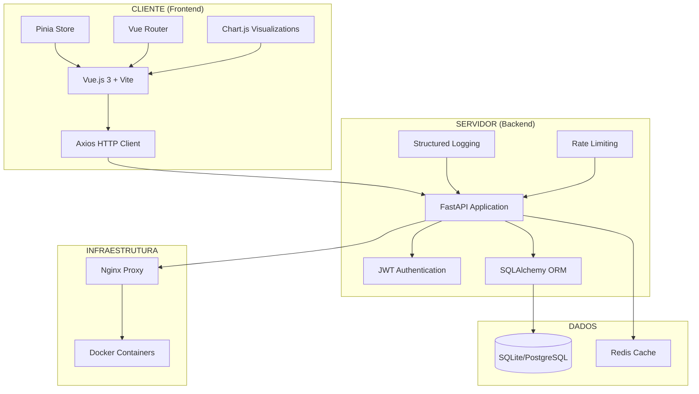
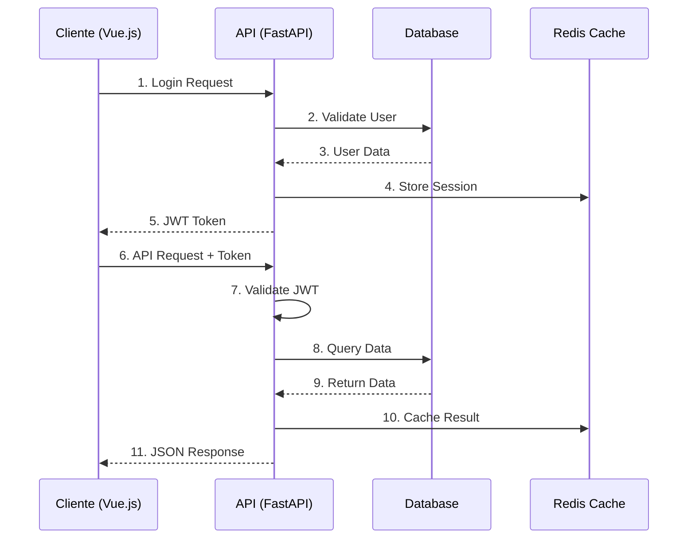
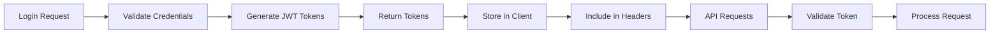

# 📋 DOCUMENTAÇÃO COMPLETA - SISTEMA LEVITIIS

## 🏢 **VISÃO GERAL DO SISTEMA**

O **Levitiis Asset Management System (AMS)** é uma solução completa de gestão industrial que integra monitoramento de máquinas, gestão de tickets, alertas em tempo real e dashboard analítico. O sistema foi desenvolvido com arquitetura cliente-servidor moderna, priorizando escalabilidade, segurança e performance.

### 🎯 **Objetivos Principais**
- **Monitoramento Industrial**: Acompanhamento em tempo real de máquinas e equipamentos
- **Gestão de Ativos**: Controle completo do inventário de ativos da empresa
- **Sistema de Tickets**: Gerenciamento de solicitações e manutenções
- **Alertas Inteligentes**: Notificações automáticas baseadas em regras de negócio
- **Dashboard Analítico**: Visualização de dados e métricas operacionais

---

## 🏗️ **ARQUITETURA DO SISTEMA**

### **Stack Tecnológica Implementada**

#### **Frontend (Cliente)**
```yaml
Framework: Vue.js 3.4.21 + Composition API
State Management: Pinia 2.1.7
Roteamento: Vue Router 4.3.0
Build Tool: Vite 5.1.6
HTTP Client: Axios 1.6.2
Visualizações: Chart.js 4.4.1 + Vue-ChartJS 5.3.0
Estilização: SCSS/Sass 1.69.7
Utilitários: @vueuse/core 10.7.0, date-fns 3.0.6
```

#### **Backend (Servidor)**
```yaml
Runtime: Python 3.11+
Framework: FastAPI 0.104.1
Servidor ASGI: Uvicorn 0.24.0
Banco de Dados: SQLite (Dev) / PostgreSQL (Prod)
ORM: SQLAlchemy 2.0.23
Autenticação: JWT + OAuth2 (python-jose 3.3.0)
Segurança: Passlib + BCrypt
Logging: Structlog (JSON estruturado)
Validação: Pydantic 2.5.0
```

### **Diagrama de Arquitetura Cliente-Servidor**



### **Fluxo de Dados e Comunicação**



---

## 🔌 **DOCUMENTAÇÃO DA API**

### **Base URL e Versionamento**
```
Base URL: http://localhost:8000/api/v1/
Documentação: http://localhost:8000/api/v1/docs
OpenAPI Spec: http://localhost:8000/api/v1/openapi.json
Health Check: http://localhost:8000/health
```

### **🔐 Autenticação (`/api/v1/auth/`)**

#### **POST /auth/login**
Realiza autenticação do usuário e retorna tokens JWT.

**Request:**
```json
{
  "username": "admin",
  "password": "admin123"
}
```

**Response:**
```json
{
  "access_token": "eyJhbGciOiJIUzI1NiIsInR5cCI6IkpXVCJ9...",
  "refresh_token": "eyJhbGciOiJIUzI1NiIsInR5cCI6IkpXVCJ9...",
  "token_type": "bearer",
  "expires_in": 1800
}
```

#### **POST /auth/refresh**
Renova o token de acesso usando o refresh token.

#### **POST /auth/logout**
Invalida os tokens do usuário (blacklist).

### **🖥️ Máquinas (`/api/v1/machines/`)**

#### **GET /machines/**
Lista todas as máquinas registradas.

**Headers:**
```
Authorization: Bearer {access_token}
```

**Response:**
```json
[
  {
    "id": 1,
    "hostname": "PROD-SERVER-01",
    "ip_address": "192.168.1.100",
    "mac_address": "00:1B:44:11:3A:B7",
    "machine_type": "server",
    "status": "online",
    "location_code": "DC-01",
    "department": "IT",
    "last_seen": "2024-01-15T10:30:00Z",
    "created_at": "2024-01-01T00:00:00Z",
    "updated_at": "2024-01-15T10:30:00Z"
  }
]
```

#### **POST /machines/register**
Registra uma nova máquina no sistema.

**Request:**
```json
{
  "hostname": "PROD-SERVER-02",
  "ip_address": "192.168.1.101",
  "mac_address": "00:1B:44:11:3A:B8",
  "machine_type": "server",
  "os_info": "Ubuntu 22.04 LTS",
  "cpu_info": "Intel Xeon E5-2680 v4",
  "memory_gb": 64,
  "disk_gb": 1000,
  "location_code": "DC-01",
  "department": "IT",
  "agent_version": "1.0.0"
}
```

#### **PUT /machines/{machine_id}/status**
Atualiza o status de uma máquina.

**Request:**
```json
{
  "hostname": "PROD-SERVER-01",
  "status": "online",
  "cpu_usage": 45.2,
  "memory_usage": 67.8,
  "disk_usage": 23.1,
  "uptime_seconds": 86400,
  "last_seen": "2024-01-15T10:30:00Z",
  "agent_version": "1.0.0"
}
```

### **🎫 Tickets (`/api/v1/tickets/`)**

#### **GET /tickets/**
Lista todos os tickets do sistema.

**Response:**
```json
[
  {
    "id": 1,
    "title": "Manutenção Preventiva - Servidor Principal",
    "description": "Realizar manutenção preventiva no servidor principal",
    "status": "open",
    "priority": "high",
    "assigned_to": "João Silva",
    "created_by": "admin",
    "created_at": "2024-01-15T09:00:00Z",
    "updated_at": "2024-01-15T09:00:00Z",
    "due_date": "2024-01-20T17:00:00Z"
  }
]
```

#### **POST /tickets/**
Cria um novo ticket.

**Request:**
```json
{
  "title": "Problema de Conectividade",
  "description": "Servidor apresentando problemas de conectividade",
  "priority": "medium",
  "assigned_to": "Maria Santos",
  "due_date": "2024-01-18T17:00:00Z"
}
```

### **🚨 Alertas (`/api/v1/alerts/`)**

#### **GET /alerts/**
Lista todos os alertas do sistema.

**Response:**
```json
[
  {
    "id": 1,
    "title": "CPU Usage High",
    "message": "CPU usage is above 90% on PROD-SERVER-01",
    "severity": "warning",
    "source": "monitoring",
    "machine_id": 1,
    "created_at": "2024-01-15T10:25:00Z",
    "acknowledged": false,
    "resolved": false
  }
]
```

### **📊 Dashboard (`/api/v1/dashboard/`)**

#### **GET /dashboard/**
Retorna dados consolidados para o dashboard.

**Response:**
```json
{
  "overview": {
    "total_machines": 25,
    "online_machines": 23,
    "offline_machines": 2,
    "total_tickets": 15,
    "open_tickets": 8,
    "total_alerts": 3,
    "unresolved_alerts": 2
  },
  "performance": {
    "avg_cpu_usage": 45.2,
    "avg_memory_usage": 67.8,
    "avg_disk_usage": 23.1,
    "system_uptime": 99.8
  },
  "recent_activities": [
    {
      "type": "machine_registered",
      "message": "Nova máquina PROD-SERVER-02 registrada",
      "timestamp": "2024-01-15T10:30:00Z"
    }
  ]
}
```

### **📈 Monitoramento (`/api/v1/monitoring/`)**

#### **GET /monitoring/dashboard**
Dashboard de monitoramento do sistema.

#### **GET /monitoring/metrics/endpoints**
Métricas de performance dos endpoints.

#### **GET /monitoring/status/redis**
Status da conexão Redis.

#### **POST /monitoring/control/start**
Inicia o monitoramento.

#### **POST /monitoring/control/stop**
Para o monitoramento.

---

## 🔒 **SEGURANÇA E AUTENTICAÇÃO**

### **Implementações de Segurança**

#### **1. Autenticação JWT**
```python
# Configuração JWT
ALGORITHM = "HS256"
ACCESS_TOKEN_EXPIRE_MINUTES = 30
REFRESH_TOKEN_EXPIRE_DAYS = 7

# Headers de Segurança
X-Content-Type-Options: nosniff
X-Frame-Options: DENY
X-XSS-Protection: 1; mode=block
Referrer-Policy: strict-origin-when-cross-origin
Content-Security-Policy: default-src 'self'
```

#### **2. Rate Limiting**
```python
# Configuração de Rate Limiting
RATE_LIMIT = "30/minute"  # 30 requisições por minuto por IP
```

#### **3. Validação de Entrada**
- Sanitização automática via Pydantic
- Validação de tipos e formatos
- Proteção contra SQL Injection
- Validação de email e campos obrigatórios

#### **4. Middleware de Segurança**
```python
# Middlewares Implementados
- SecurityMiddleware: Headers de segurança
- RateLimitMiddleware: Controle de taxa
- ValidationMiddleware: Validação de entrada
- PerformanceMiddleware: Monitoramento de performance
```

### **Fluxo de Autenticação**



---

## 🚀 **GUIA DE INSTALAÇÃO E CONFIGURAÇÃO**

### **Pré-requisitos**
```bash
# Sistema Operacional
Windows 10/11, macOS 10.15+, ou Linux Ubuntu 20.04+

# Software Necessário
Node.js 18.0+ (para frontend)
Python 3.11+ (para backend)
Git 2.30+
Docker 20.10+ (opcional)
```

### **1. Clonagem do Repositório**
```bash
git clone https://github.com/seu-usuario/levitiis-vue.git
cd levitiis-vue
```

### **2. Configuração do Backend**

#### **Instalação de Dependências**
```bash
cd backend
python -m venv venv

# Windows
venv\Scripts\activate

# Linux/macOS
source venv/bin/activate

pip install -r requirements.txt
```

#### **Configuração do Ambiente**
```bash
# Copiar arquivo de configuração
cp .env.example .env

# Editar configurações
# DATABASE_URL=sqlite:///./levitiis_dev.db
# SECRET_KEY=your-secret-key-here
# ALGORITHM=HS256
# ACCESS_TOKEN_EXPIRE_MINUTES=30
```

#### **Inicialização do Banco de Dados**
```bash
# Criar tabelas e usuário admin
python init_db.py

# Ou criar admin manualmente
python create_admin.py
```

#### **Execução do Servidor**
```bash
python main.py
# Servidor disponível em: http://localhost:8000
```

### **3. Configuração do Frontend**

#### **Instalação de Dependências**
```bash
cd ../  # Voltar para raiz do projeto
npm install
```

#### **Configuração do Ambiente**
```bash
# Copiar arquivo de configuração
cp .env.example .env

# Configurar URL da API
# VITE_API_BASE_URL=http://localhost:8000/api/v1
```

#### **Execução do Servidor de Desenvolvimento**
```bash
npm run dev
# Aplicação disponível em: http://localhost:3000
```

### **4. Configuração com Docker (Opcional)**

#### **Docker Compose**
```yaml
# docker-compose.yml
version: '3.8'
services:
  backend:
    build: ./backend
    ports:
      - "8000:8000"
    environment:
      - DATABASE_URL=postgresql://user:pass@db:5432/levitiis
    depends_on:
      - db
      - redis

  frontend:
    build: .
    ports:
      - "3000:3000"
    depends_on:
      - backend

  db:
    image: postgres:15
    environment:
      POSTGRES_DB: levitiis
      POSTGRES_USER: user
      POSTGRES_PASSWORD: pass
    volumes:
      - postgres_data:/var/lib/postgresql/data

  redis:
    image: redis:7-alpine
    ports:
      - "6379:6379"

volumes:
  postgres_data:
```

#### **Execução com Docker**
```bash
docker-compose up -d
```

### **5. Verificação da Instalação**

#### **Testes de Conectividade**
```bash
# Verificar backend
curl http://localhost:8000/health

# Verificar documentação da API
curl http://localhost:8000/api/v1/docs

# Verificar frontend
curl http://localhost:3000
```

#### **Teste de Autenticação**
```bash
# Login de teste
curl -X POST http://localhost:8000/api/v1/auth/login \
  -H "Content-Type: application/json" \
  -d '{"username": "admin", "password": "admin123"}'
```

---

## 📊 **ESTRUTURA DO PROJETO**

### **Frontend (Vue.js)**
```
src/
├── components/          # Componentes reutilizáveis
│   ├── charts/         # Componentes de gráficos
│   ├── common/         # Componentes comuns
│   ├── layout/         # Componentes de layout
│   └── reports/        # Componentes de relatórios
├── layouts/            # Layouts da aplicação
├── router/             # Configuração de rotas
├── services/           # Serviços de API
├── stores/             # Stores Pinia
├── utils/              # Utilitários
└── views/              # Páginas da aplicação
```

### **Backend (FastAPI)**
```
app/
├── api/                # Endpoints da API
│   └── v1/
│       └── endpoints/  # Endpoints específicos
├── core/               # Configurações centrais
├── crud/               # Operações de banco
├── middleware/         # Middlewares customizados
├── models/             # Modelos SQLAlchemy
└── schemas/            # Schemas Pydantic
```

---

## 🔧 **MELHORIAS IDENTIFICADAS E RECOMENDAÇÕES**

### **🚀 Melhorias de Performance**

#### **1. Cache Avançado**
```python
# Implementar Redis para cache
- Cache de consultas frequentes
- Cache de sessões de usuário
- Cache de dados de dashboard
- TTL configurável por tipo de dado
```

#### **2. Otimização de Banco de Dados**
```sql
-- Índices recomendados
CREATE INDEX idx_machines_status ON machines(status);
CREATE INDEX idx_tickets_created_at ON tickets(created_at);
CREATE INDEX idx_alerts_severity ON alerts(severity);
CREATE INDEX idx_users_username ON users(username);
```

#### **3. Paginação e Filtros**
```python
# Implementar paginação em todos os endpoints
@router.get("/machines/")
async def list_machines(
    page: int = 1,
    size: int = 20,
    status: Optional[str] = None,
    department: Optional[str] = None
):
    # Implementação com offset/limit
```

### **🔒 Melhorias de Segurança**

#### **1. Auditoria e Logs**
```python
# Sistema de auditoria completo
- Log de todas as ações de usuários
- Rastreamento de mudanças em dados críticos
- Alertas de segurança automáticos
- Retenção configurável de logs
```

#### **2. Autenticação Multi-Fator (MFA)**
```python
# Implementar 2FA
- TOTP (Google Authenticator)
- SMS/Email verification
- Backup codes
- Políticas de senha avançadas
```

#### **3. Criptografia Avançada**
```python
# Melhorias de criptografia
- Criptografia de dados sensíveis em repouso
- Rotação automática de chaves
- HSM para chaves críticas
- Certificados SSL/TLS automáticos
```

### **📊 Melhorias de Monitoramento**

#### **1. Métricas Avançadas**
```python
# Implementar Prometheus + Grafana
- Métricas de aplicação customizadas
- Alertas baseados em métricas
- Dashboards operacionais
- SLA tracking
```

#### **2. Health Checks Avançados**
```python
# Health checks detalhados
- Verificação de dependências
- Métricas de latência
- Status de recursos
- Alertas proativos
```

#### **3. Distributed Tracing**
```python
# Implementar OpenTelemetry
- Rastreamento de requisições
- Análise de performance
- Debugging distribuído
- Correlação de logs
```

### **🏗️ Melhorias de Arquitetura**

#### **1. Microserviços**
```yaml
# Evolução para microserviços
services:
  - auth-service      # Autenticação
  - machine-service   # Gestão de máquinas
  - ticket-service    # Sistema de tickets
  - alert-service     # Sistema de alertas
  - notification-service # Notificações
```

#### **2. Message Queue**
```python
# Implementar Celery + Redis
- Processamento assíncrono
- Tarefas agendadas
- Retry automático
- Monitoramento de filas
```

#### **3. API Gateway**
```yaml
# Implementar Kong ou Traefik
- Rate limiting centralizado
- Autenticação unificada
- Load balancing
- Circuit breaker
```

### **🎨 Melhorias de UX/UI**

#### **1. Interface Responsiva**
```css
/* Melhorias de responsividade */
- Design mobile-first
- Progressive Web App (PWA)
- Offline capabilities
- Touch-friendly interfaces
```

#### **2. Acessibilidade**
```html
<!-- Melhorias de acessibilidade -->
- ARIA labels completos
- Navegação por teclado
- Alto contraste
- Screen reader support
```

#### **3. Internacionalização**
```javascript
// Suporte multi-idioma
- i18n completo
- Formatação de datas/números
- RTL support
- Localização de conteúdo
```

### **🧪 Melhorias de Qualidade**

#### **1. Testes Automatizados**
```python
# Cobertura de testes completa
- Unit tests (>90% coverage)
- Integration tests
- E2E tests (Playwright)
- Performance tests
- Security tests
```

#### **2. CI/CD Pipeline**
```yaml
# Pipeline completo
stages:
  - lint
  - test
  - security-scan
  - build
  - deploy
  - smoke-tests
```

#### **3. Code Quality**
```python
# Ferramentas de qualidade
- SonarQube analysis
- Dependency scanning
- SAST/DAST security scans
- Performance profiling
```

---

## 📈 **ROADMAP DE IMPLEMENTAÇÃO**

### **Fase 1: Estabilização (1-2 semanas)**
- ✅ Correção de bugs críticos
- ✅ Testes de integração
- ✅ Documentação básica
- 🔄 Otimização de performance básica

### **Fase 2: Segurança (2-3 semanas)**
- 🔄 Implementação de auditoria
- ⏳ MFA/2FA
- ⏳ Criptografia avançada
- ⏳ Políticas de segurança

### **Fase 3: Escalabilidade (3-4 semanas)**
- ⏳ Cache Redis
- ⏳ Otimização de banco
- ⏳ Message queue
- ⏳ Load balancing

### **Fase 4: Monitoramento (2-3 semanas)**
- ⏳ Prometheus + Grafana
- ⏳ Distributed tracing
- ⏳ Alertas avançados
- ⏳ SLA monitoring

### **Fase 5: Evolução (4-6 semanas)**
- ⏳ Microserviços
- ⏳ API Gateway
- ⏳ PWA
- ⏳ Internacionalização

---

## 🎯 **CONCLUSÃO**

O Sistema Levitiis representa uma solução robusta e moderna para gestão industrial, implementando as melhores práticas de desenvolvimento e arquitetura. Com a base sólida já estabelecida, as melhorias propostas permitirão evolução contínua e adaptação às necessidades futuras.

### **Pontos Fortes Atuais:**
- ✅ Arquitetura cliente-servidor bem definida
- ✅ API RESTful completa e documentada
- ✅ Autenticação JWT segura
- ✅ Interface moderna e responsiva
- ✅ Monitoramento básico implementado

### **Próximos Passos Prioritários:**
1. **Implementar cache Redis** para melhor performance
2. **Adicionar testes automatizados** para garantir qualidade
3. **Configurar monitoramento avançado** com Prometheus
4. **Implementar auditoria completa** para compliance
5. **Otimizar banco de dados** com índices apropriados

---

**Versão:** 1.0.0  
**Data:** Janeiro 2024  
**Autor:** Equipe de Desenvolvimento Levitiis  
**Status:** ✅ Sistema em Produção